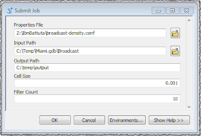
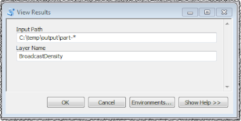

# Ibn Battuta

This project is named after the great Moroccan explorer [Ibn Battuta](https://en.wikipedia.org/wiki/Ibn_Battuta). 

This is my Rihla (Journey) into [Spark](http://spark.apache.org/) Spatial DataFrame implementations.

A set of advanced features are now available in the newly released [Spark 1.5.0](http://spark.apache.org/releases/spark-release-1-5-0.html). This includes:

* The integration of [Project Tungsten](http://www.oreilly.com/pub/e/3474), that brings Spark closer to the bare metal and takes advantage of off-heap memory.
* A [unified](https://databricks.com/blog/2015/02/17/introducing-dataframes-in-spark-for-large-scale-data-science.html) high performance execution environment across Scala, Java, Python and R using the [DataFrame](http://spark.apache.org/docs/latest/sql-programming-guide.html) API.

This ongoing project is my journey into:

* Using [File GeoDatabases](http://www.esri.com/news/arcuser/0309/files/9reasons.pdf) and [Shapefiles](https://en.wikipedia.org/wiki/Shapefile) as "native" DataFrame sources.
* Creating Spatial User Defined Types to be used in Scala, Python and R.
* Creating Spatial User Defined Functions to be used in Scala and Python.
* Influencing the [execution plan](https://databricks.com/blog/2015/04/13/deep-dive-into-spark-sqls-catalyst-optimizer.html) of spatial join queries in such that a map-side join or a reduce-side join is selected
appropriately based on the input data.
* Submit a Spark Job from ArcGIS Desktop or Server that takes advantage of the above for high performing GeoProcessing tasks.

## Setting Up Your Environment

I'm assuming that the following will be done on a Windows based platform. The same can be done on Linux, but most AGS installations are on Windows.

*Note to self:* One of these days, create an Install program. Or better, use [Docker](https://www.docker.com/). 

* Download and install [JDK 1.8](http://www.oracle.com/technetwork/java/javase/downloads/jdk8-downloads-2133151.html).
* Define a system environment variable named `JAVA_HOME` whose value is the folder location where you installed the JDK.
* Update the `PATH` system environment variable with `%JAVA_HOME%\bin`, in such that you can execute the following in a `cmd` window.

```
C:\>java -version
java version "1.8.0_60"
Java(TM) SE Runtime Environment (build 1.8.0_60-b27)
Java HotSpot(TM) 64-Bit Server VM (build 25.60-b23, mixed mode)
```

* Download and unzip [Hadoop Common](https://github.com/srccodes/hadoop-common-2.2.0-bin/archive/master.zip).
Spark uses the [Hadoop File System API](https://hadoop.apache.org/docs/current/api/org/apache/hadoop/fs/FileSystem.html) to read data sources and to write data sinks.
And *NO*, you do not need HDFS for this, as a data source path can be a URL with a `file://` scheme :-)
* Define a system environment variable named `HADOOP_HOME` whose value is the unzipped folder location. There should be a `bin\winutils.exe` under that path.
 
* Download and unpack [spark-1.5.0-bin-hadoop2.6.tgz](http://d3kbcqa49mib13.cloudfront.net/spark-1.5.0-bin-hadoop2.6.tgz).
* Define a system environment variable named `SPARK_HOME` whose value is the folder location where you unpacked Spark.
* Update the `PATH` system environment variable with `%SPARK_HOME%\bin`, in such that you can execute the following in a `cmd` window.

```
C:\>spark-submit --version
Welcome to
      ____              __
     / __/__  ___ _____/ /__
    _\ \/ _ \/ _ `/ __/  '_/
   /___/ .__/\_,_/_/ /_/\_\   version 1.5.0
      /_/

Type --help for more information.```
```

Finally, to read [FileGeoDatabases](http://www.esri.com/news/arcuser/0309/files/9reasons.pdf) (this is so embarrassing), I'm relying
on the [GeoTools OGR implementation](http://docs.geotools.org/stable/userguide/library/data/ogr.html) that uses a [GDAL](http://www.gdal.org/drv_openfilegdb.html) implementation.
The FileGeoDatabase format is closed, unlike the [Shapefile](https://en.wikipedia.org/wiki/Shapefile) format.
Esri does provide a read-only `C` based [API](http://www.esri.com/apps/products/download/#File_Geodatabase_API_1.4), but do not want to write a Scala wrapper, nor want to reimplement the API in pure Java or Scala.
However, one of these days I have to do this to enable a parallel reading off a distributed file system.
Today's reliance on the the GeoTools implementation makes the input unsplittable and dependents on a [POSIX file system](https://en.wikipedia.org/wiki/POSIX).
 
* Download and install the [64bit OSGeo4W](http://trac.osgeo.org/osgeo4w/).
* Define a system environment variable named `OSGEO4W64_HOME` whose value is the folder where you installed OSGeo4W64.
* Update the `PATH` system environment variable with `%OSGEO4W64_HOME%\bin`, in such that you can execute the following in a `cmd` window.

```
C:\>ogr2ogr.exe --version
GDAL 1.11.2, released 2015/02/10
```

## Build the FileGDB DataFrame API

The build process is [Maven](https://maven.apache.org/) based.

```bash
mvn clean package
```

This will create in the `target` folder a `.jar` file and a `.zip` file.
The `.zip` file contains the `.jar` file, the ArcPy Toolbox and its supporting files.
 
By default, the `OSGEO4W64_HOME` is assumed to be in `C:\OSGeo4W64`. A different location can be specified using:

```bash
mvn -Dosgeo4w64.home=${OSGEO4W64} clean package
```

Or on Windows:

```
mvn -Dosgeo4w64.home=%OSGEO4W64% clean package
```

## Using the DataFrame API

This implementation is based on the [Spark CSV](https://github.com/databricks/spark-csv) project.
You can download the sample data in FileGDB format from [MarineCadaster.gov](ftp://ftp.coast.noaa.gov/temp/MarineCadastre/AIS.SampleData.zip).

In this implementation, I'm not using a custom User Defined SQL Type.
Instead, I'm relying on predefined types, in such that a Point is converted into a `StructType` with a `StructField` labeled `x` and a `StructField` labeled `y`.
Looking at the Spark source code, there is a reference implementation of an `ExamplePoint` with Python bindings that I will use in my later explorations.

### Scala API Example

```bash
spark-shell\
 --master "local[*]"\
 --driver-memory 1G\
 --executor-memory 8G\
 --packages org.geotools:gt-ogr-bridj:14-beta,org.geotools:gt-cql:14-beta\
 --jars target/ibn-battuta-0.1.jar
```

```scala
val df=sqlContext.read.
format("com.esri.battuta.fgb").
option("fields","the_geom,Status").
option("cql","Status > 0").
load("/Users/mraad_admin/Share/Miami.gdb/Broadcast")
df.registerTempTable("POINTS")
df.sqlContext.sql("select the_geom['x'] as lon,the_geom['y'] as lat,Status from POINTS limit 10").show()
```

### Python API Example

```shell
pyspark\
 --master "local[*]"\
 --driver-memory 1G\
 --executor-memory 8G\
 --packages org.geotools:gt-ogr-bridj:14-beta,org.geotools:gt-cql:14-beta\
 --jars target/ibn-battuta-0.1.jar
```

```python
df = sqlContext.read.\
format('com.esri.battuta.fgb').\
option('fields','the_geom,Status').\
load('/Users/mraad_admin/Share/Miami.gdb/Broadcast')
df.registerTempTable('POINTS')
sqlContext.sql("SELECT the_geom['x'],the_geom['y'] FROM POINTS WHERE Status>0 LIMIT 5").show()
```

## Submitting Spark Jobs Using ArcPy

Originally, I wanted to write a GeoProcessing Extension in Scala that submits Scala based Spark jobs from ArcGIS Desktop and Server.
However, I immediately ran into problems with Java version incompatibilities between the internal 1.6 and my wanting
to take advantage of 1.8 features. In addition, I wanted to "script" the GeoProcessing
tasks, in such that I can change the logic _without_ an explicit recompilation and redeployment.
So, I decided to stay in Python land as ArcGIS and Spark natively support that environment.
Now, do not misunderstand me! You _cannot_ send [ArcPy](http://resources.arcgis.com/EN/HELP/MAIN/10.1/index.html#/What_is_ArcPy/000v000000v7000000/) code to Spark for fast parallel execution (at least not today :-).
However, you can use ArcPy to submit Python, R, Scala and Java based Spark Jobs.

And that is exactly what the `BroadcastDensity.pyt` toolbox does as a proof of concept.
When executed from ArcGIS, it prompts the user to define the values of the input parameters of a Python based Spark job and submits
that job using the [spark-submit](http://spark.apache.org/docs/latest/submitting-applications.html) command line interface.
It [asynchronously](http://stefaanlippens.net/python-asynchronous-subprocess-pipe-reading) monitors the execution of the job and reports its status as a set of [ArcPy messages](http://resources.arcgis.com/EN/HELP/MAIN/10.1/index.html#//018v00000007000000).

The toolbox and all the required resources are packaged in a zip file in the `target` folder after `mvn package`.



The tools invokes `broadcast-density.py` using `spark-submit.cmd` with the Spark properties in `broadcast-density.conf`.
The following is a snippet of `broadcast-density.py` that highlights the DataFrame API and SparkSQL:

```
df = sqlContext.read \
    .format('com.esri.battuta.fgb') \
    .options(fields='the_geom', cql='Status > 0') \
    .load(input_path)

df.registerTempTable("POINTS")

sql = '''
      select c*{cell0}+{cell2} as lon,r*{cell0}+{cell2} as lat,count(1) as pop from
      (select cast(the_geom['x']/{cell0} as int) as c, cast(the_geom['y']/{cell0} as int) as r from POINTS) as T
      group by c,r having pop>{pop}
    '''.format(cell0=cell0, cell2=cell2, pop=pop)

sqlContext.sql(sql).write.json(output_path)
```

The inner `select` maps the x/y coordinates to col/row cells.
The outer `select` aggregates and counts the occurrence of the col/row tuple.
The dataframe rows are saved as a sequence of JSON documents.



The `ViewTool` iterates over the `part-xxxx` files in the output folder and converts each parsed JSON document into
a feature in an in-memory feature class.
